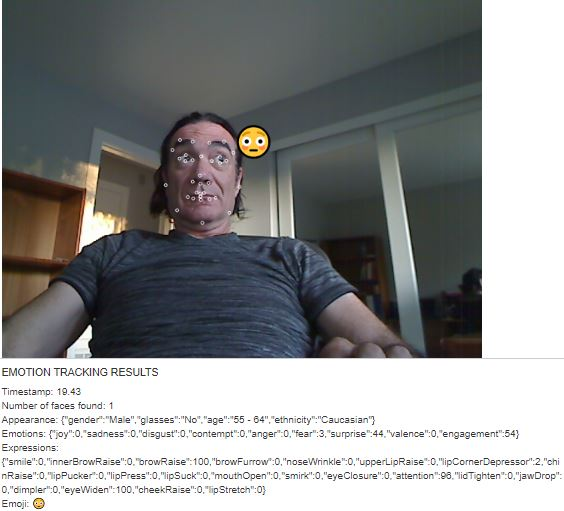
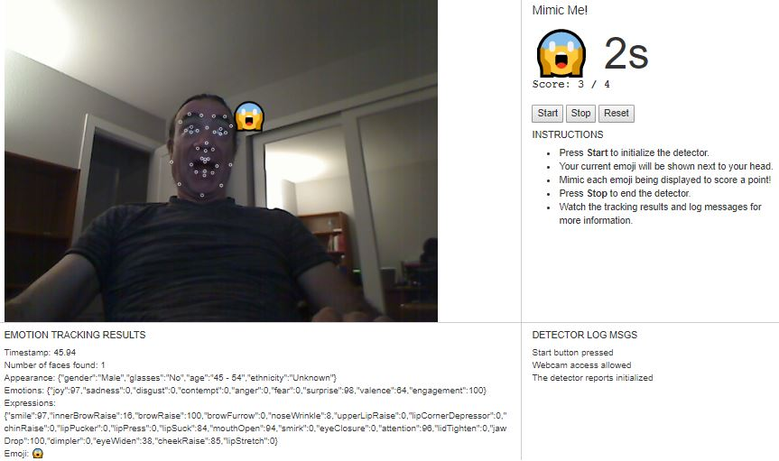

# Mimic Me! Project Report
by Phil Ferriere
07/09/2017

## Overview

In this project, we track faces in a video and identify facial expressions using [Affectiva](http://www.affectiva.com/)’s Emotion-as-a-Service API

## Project files

To project files are:

- **mimic.js**: Javascript file with code that connects to the Affectiva API and processes results.
- **index.html**: Dynamic webpage that displays the video feed and results.
- **mimic.css**: Stylesheet file that defines the layout and presentation for HTML elements.
- **serve.py**: A lightweight Python webserver required to serve the webpage over HTTPS, so that we can access the webcam feed.
- **generate-pemfile.sh**: A shell script you’ll need to run once to generate an SSL certificate for the webserver.

## Tasks

We were asked to implement three different tasks:

### 1. Display Feature Points

The first task was to display the feature points on top of the webcam image that are returned along with the metrics. This was done by looping through the list of feature points returned by the SDK (`face.featurePoints`), extracting their coordinates, and rendering them as tiny cicles over the captured video image. This was implemented in the `drawFeaturePoints()` function as follows:

```javascript
function drawFeaturePoints(canvas, img, face) {
  // Obtain a 2D context object to draw on the canvas
  var ctx = canvas.getContext('2d');

  // Set the stroke and/or fill style you want for each feature point marker
  // See: https://developer.mozilla.org/en-US/docs/Web/API/CanvasRenderingContext2D#Fill_and_stroke_styles
  ctx.strokeStyle = 'white';

  // Loop over each feature point in the face
  for (var id in face.featurePoints) {
    var featurePoint = face.featurePoints[id];

    // TODO: Draw feature point, e.g. as a circle using ctx.arc()
    ctx.beginPath();
    ctx.arc(featurePoint.x, featurePoint.y, 2, 0, Math.PI * 2);
    ctx.stroke();
  }
}
```

Here's a screenshot that presents the result:



### 2. Show Dominant Emoji

In addition to feature points and metrics that capture facial expressions and emotions, the Affectiva API also reports back what emoji best represents the current emotional state of a face. This is referred to as the _dominant emoji_. It is exposed by the SDK as `face.emojis.dominantEmoji` and rendered close to the left eyebrow (the feature point at index 10). This was implemented in the `drawEmoji()` function as follows:

```javascript
var left_eyebrow_idx = 10;
function drawEmoji(canvas, img, face) {
  // Obtain a 2D context object to draw on the canvas
  var ctx = canvas.getContext('2d');

  // Set the font and style you want for the emoji
  ctx.font = '40px serif'
  
  // Draw it using ctx.strokeText() or fillText()
  // See: https://developer.mozilla.org/en-US/docs/Web/API/CanvasRenderingContext2D/fillText
  // We picked the corner of the left eyebrow as the anchor
  ctx.fillText(face.emojis.dominantEmoji, face.featurePoints[left_eyebrow_idx].x, face.featurePoints[left_eyebrow_idx].y);
}
```

Please refer to the previous screenshot as a reference.

### 3. Implement Mimic Me!

The game mechanics are fairly straightforward. The user is presented with an emoji and has up to 12s to mimic it. A timer on the right of the tartget to mimic shows how much time the user has left. We maintain and also display a score of the number of emojis the user was able to succesfully mimicing.

The main code loop exacutes a match against the dominant emoji and the current target every time we get new information from the face detector. If the match is valid, the score is increased. At the end of the 12s, we load a new target emoji to mimic and go through the main loop again. Here's an extract of the relevant code:

```javascript
var targetEmojiCode = emojis[0];
var newCorrectGuess = false;
var numTotalGuesses = 0;
var numCorrectGuesses = 0;
var guessStartTime = 0;
var guessCurrTime = 0;
var guessMaxTime = 12;

function setTargetEmojiAndTimer(code, timeLeft) {
  $("#target").html("&#" + code + ";" + " " + timeLeft+ "s");
}

function resetTargetAndScore() {
  newCorrectGuess = false;
  numTotalGuesses = 0;
  numCorrectGuesses = 0;
  guessStartTime = 0;
  guessCurrTime = 0;
  $("#target").text("?");
  setScore(numCorrectGuesses, numTotalGuesses);
};

// Add a callback to receive the results from processing an image
detector.addEventListener("onImageResultsSuccess", function(faces, image, timestamp) {
  var canvas = $('#face_video_canvas')[0];
  if (!canvas)
    return;

  // Report how many faces were found
  $('#results').html("");
  log('#results', "Timestamp: " + timestamp.toFixed(2));
  log('#results', "Number of faces found: " + faces.length);

  guessCurrTime = Math.max(guessCurrTime, timestamp.toFixed(0));
  if (numTotalGuesses == 0 || guessCurrTime > guessStartTime && guessCurrTime % guessMaxTime == 0) {
    // Per this post on SO: https://stackoverflow.com/questions/1527803/generating-random-whole-numbers-in-javascript-in-a-specific-range
    // Use the formula Math.floor(Math.random() * (max - min + 1)) + min;
    // where min here is 0 and max is 12
    targetEmojiCode = emojis[Math.floor(Math.random() * 13)];
    newCorrectGuess = false;
    numTotalGuesses = numTotalGuesses + 1;
    setScore(numCorrectGuesses, numTotalGuesses);
    setTargetEmojiAndTimer(targetEmojiCode, guessMaxTime);
    guessStartTime = guessCurrTime;
  } else {
    setTargetEmojiAndTimer(targetEmojiCode, guessMaxTime - guessCurrTime % guessMaxTime);
  }

  if (faces.length > 0) {
    // Report desired metrics
    log('#results', "Appearance: " + JSON.stringify(faces[0].appearance));
    log('#results', "Emotions: " + JSON.stringify(faces[0].emotions, function(key, val) {
      return val.toFixed ? Number(val.toFixed(0)) : val;
    }));
    log('#results', "Expressions: " + JSON.stringify(faces[0].expressions, function(key, val) {
      return val.toFixed ? Number(val.toFixed(0)) : val;
    }));
    log('#results', "Emoji: " + faces[0].emojis.dominantEmoji);

    // Call functions to draw feature points and dominant emoji (for the first face only)
    drawFeaturePoints(canvas, image, faces[0]);
    drawEmoji(canvas, image, faces[0]);

    // Evaluate if the user was able to sucessfully match the target emoji
    if (!newCorrectGuess && (toUnicode($("#target").text()) == toUnicode(faces[0].emojis.dominantEmoji))) {
        newCorrectGuess = true;
        numCorrectGuesses = numCorrectGuesses + 1;
        setScore(numCorrectGuesses, numTotalGuesses);
      }
  }
});
```

Here's a sample run of the game:




## Affectiva Resources

- [JS SDK documentation](https://affectiva.readme.io/docs/getting-started-with-the-emotion-sdk-for-javascript).
- [Affectiva Developer portal](http://developer.affectiva.com/index.html)
- [Demo](https://jsfiddle.net/affectiva/opyh5e8d/show/) that this project is based on
- Tutorials: [Camera stream](https://affectiva.readme.io/docs/analyze-the-camera-stream-3), [video](https://affectiva.readme.io/docs/analyze-a-video-frame-stream-4), [photo](https://affectiva.readme.io/docs/analyze-a-photo-3)


<a rel="license" href="http://creativecommons.org/licenses/by-nc-nd/4.0/"></a><br />This work is licensed under a <a rel="license" href="http://creativecommons.org/licenses/by-nc-nd/4.0/">Creative Commons Attribution-NonCommercial-NoDerivatives 4.0 International License</a>. Please refer to [Udacity Terms of Service](https://www.udacity.com/legal) for further information.
