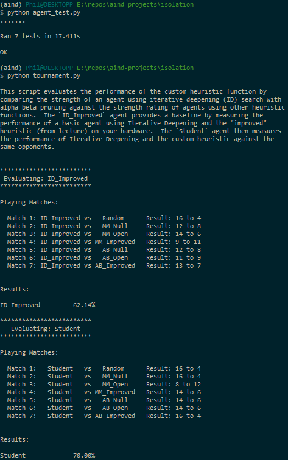

Artificial Intelligence Nanodegree Projects
===========================================

# Udacity Staff Submissions

Code file submission: [`game_agent.py`](./game_agent.py)

Heuristic analysis submission: [`heuristic_analysis.pdf`](./heuristic_analysis.pdf)

Research review submission: [`research_review.pdf`](./research_review.pdf)

# Build a Game-Playing Agent

## Install

This project requires **Python 3**. We installed [Anaconda3 v4.3.7](https://www.continuum.io/downloads), a pre-packaged Python distribution that contains all of the necessary libraries and software for this project. We also used the saved environment provided in the Anaconda lesson of the Nanodegree.

## Code

* `game_agent.py` - Contains the code for our game-playing agent (see `CustomPlayer` class).
* `agent_test.py` - Unmodified, as provided by the Udacity staff to unit test our implementation (run `python agent_test.py`).
* `tournament.py` - Unmodified, as provided by the Udacity staff to evaluate the performance of our game-playing agent (run `python tournament.py`).

This code can be tested as follows:

```
$ source activate aind
(aind) $ cd ~
(aind) $ git clone https://github.com/philferriere/aind-projects.git
(aind) $ cd aind-projects/isolation
(aind) $ python agent_test.py
(aind) $ python tournament.py
```



## Heuristics and Results Analysis

For this project, we experimented with five different heuristics. Here's a summary of their results:

||ID_Improved|Student|
|:-:|:-:|:-:|
|heuristic1()|**75.00%**|64.29%|
|heuristic2()|**73.57%**|69.29%|
|heuristic3()|**74.29%**|72.14%|
|heuristic4()|**70.71%**|69.29%|
|**heuristic5()**|62.14%|**70.00%**|

We recommend using `heuristic5()` because of the four following factors:
- it translates the notion of **positional advantage** to the specific L-shape knight-like moves allowed in the game
- by counting L-shape jumps, it matches the use of a **proven distance measure** (Manhattan vs Euclidean)
- it can leverage **sophisticated game mechanics** (max number of moves over min number of squares) to increase survival rate toward the end of the game (see `heuristic5()` details below)
- it can leverage **function inlining** and **loop unrolling** to explore more branches before timeouts

Below, we provide a justification for each heuristic as well as present how each performs against the `ID_Improved` heuristic provided by the Udacity staff.

### Heuristic 1

With this heuristic, the **more available moves `player` has available from the evaluated position, the better**. The `heuristic1()` function simply returns the difference in number of legal moves left between the players. If `player` and its opponent have the same number of moves, then the returned value is zero. If the returned value is positive (negative), then `player` is doing better (worse) than its opponent. If the returned value is "inf" ("-inf"), then `player` has won (lost) the game.

#### Results

Here's how our game-playing agent performs with this heuristic:

```
    *************************
     Evaluating: ID_Improved
    *************************

    Playing Matches:
    ----------
      Match 1: ID_Improved vs   Random    	Result: 16 to 4
      Match 2: ID_Improved vs   MM_Null   	Result: 15 to 5
      Match 3: ID_Improved vs   MM_Open   	Result: 14 to 6
      Match 4: ID_Improved vs MM_Improved 	Result: 13 to 7
      Match 5: ID_Improved vs   AB_Null   	Result: 19 to 1
      Match 6: ID_Improved vs   AB_Open   	Result: 15 to 5
      Match 7: ID_Improved vs AB_Improved 	Result: 13 to 7


    Results:
    ----------
    ID_Improved         75.00%

    *************************
       Evaluating: Student
    *************************

    Playing Matches:
    ----------
      Match 1:   Student   vs   Random    	Result: 14 to 6
      Match 2:   Student   vs   MM_Null   	Result: 13 to 7
      Match 3:   Student   vs   MM_Open   	Result: 15 to 5
      Match 4:   Student   vs MM_Improved 	Result: 9 to 11
      Match 5:   Student   vs   AB_Null   	Result: 13 to 7
      Match 6:   Student   vs   AB_Open   	Result: 12 to 8
      Match 7:   Student   vs AB_Improved 	Result: 14 to 6


    Results:
    ----------
    Student             64.29%
```

#### Analysis

Not a great heuristic, to say the least. Its benefits are that it's **easily interpretable and fast** to compute. On the downside, it is not really "game aware".  It is oblivious to the notion of positional advantage and isn't influenced at all by the specific mechanics of the game (only knight moves are allowed).

#### Implementation

Here's our implementation for this heuristic:

```python
def heuristic1(game, player):
    # Have we mon the game?
    if game.is_winner(player):
        return float("inf")

    # Do we even have moves to play?
    if game.is_loser(player):
        return float("-inf")

    # We have moves to play. How many more than our opponent?
    player_moves_left = len(game.get_legal_moves(player))
    opponent_moves_left = len(game.get_legal_moves(game.get_opponent(player)))
    return float(player_moves_left - opponent_moves_left)
```

### Heuristic 2

With this heuristic, as in `heuristic1()` the more moves the player has available from the evaluated position, the better, but **not all starting positions are equal**. If a player's position is closer to the center of the board, it is more probable that this player can do better than a player whose remaining moves are near the edge of the board (where they will have less options to move down the line).

To speed up the runtime execution of this heuristic, we use the **Manhattan distance instead of the Euclidean distance**.

#### Results

```
    *************************
     Evaluating: ID_Improved
    *************************

    Playing Matches:
    ----------
      Match 1: ID_Improved vs   Random    	Result: 16 to 4
      Match 2: ID_Improved vs   MM_Null   	Result: 16 to 4
      Match 3: ID_Improved vs   MM_Open   	Result: 18 to 2
      Match 4: ID_Improved vs MM_Improved 	Result: 12 to 8
      Match 5: ID_Improved vs   AB_Null   	Result: 16 to 4
      Match 6: ID_Improved vs   AB_Open   	Result: 12 to 8
      Match 7: ID_Improved vs AB_Improved 	Result: 13 to 7


    Results:
    ----------
    ID_Improved         73.57%

    *************************
       Evaluating: Student
    *************************

    Playing Matches:
    ----------
      Match 1:   Student   vs   Random    	Result: 17 to 3
      Match 2:   Student   vs   MM_Null   	Result: 16 to 4
      Match 3:   Student   vs   MM_Open   	Result: 14 to 6
      Match 4:   Student   vs MM_Improved 	Result: 11 to 9
      Match 5:   Student   vs   AB_Null   	Result: 15 to 5
      Match 6:   Student   vs   AB_Open   	Result: 11 to 9
      Match 7:   Student   vs AB_Improved 	Result: 13 to 7


    Results:
    ----------
    Student             69.29%
```

#### Analysis

This heuristic performs a bit better, but not by much. Yes, it does benefit from positional advantage, but still isn't really "game aware". What good is a position near the center of the board if you can't really move?

#### Implementation

Here's our implementation for this heuristic:

```python
def heuristic2(game, player):
    # Have we mon the game?
    if game.is_winner(player):
        return float("inf")

    # Do we even have moves to play?
    if game.is_loser(player):
        return float("-inf")

    # We have moves to play. How many more than our opponent?
    player_moves_left = len(game.get_legal_moves(player))
    opponent_moves_left = len(game.get_legal_moves(game.get_opponent(player)))

    if player_moves_left != opponent_moves_left:
        return float(player_moves_left - opponent_moves_left)

    else:
        # If we have the same number of moves available, look for a positional advantage.
        # Use the Manhattan distance to the center of the board to assess positional advantage.
        center_y_pos, center_x_pos = int(game.height / 2), int(game.width / 2)
        player_y_pos, player_x_pos = game.get_player_location(player)
        opponent_y_pos, opponent_x_pos = game.get_player_location(game.get_opponent(player))
        player_distance = abs(player_y_pos - center_y_pos) + abs(player_x_pos - center_x_pos)
        opponent_distance = abs(opponent_y_pos - center_y_pos) + abs(opponent_x_pos - center_x_pos)
        # All we need now is to take the difference between the two distances to evaluate positional advantage.
        # Scale this number between 0 and +-1 (a positional advantage can't be as good as being ahead by one move)
        # Best case, our opponent's distance is 6 from the center (for a 7x7 grid) and we're at pos 0,0 -> return 0.6
        # Worst case, our opponent's distance is 0 from the center (for a 7x7 grid) and we're in a corner -> return -0.6
        # If both players are at the same distance from the center -> return 0.
        return float(opponent_distance - player_distance) / 10.
```

### Heuristic 3

This heuristic builds on the previous one and infuses a bit of knowledge about the mechanics of the game. As with `heuristic2()`, the more moves `player` has available from the evaluated position, the better, but not all starting positions are equal. If a player's position is closer to the center of the board, it is more probable that this player can do better than a player whose remaining moves are near the edge of the board (where they will have less options to move down the line). If there is no clear positional advantage (i.e. both players are at the same distance from the center, then we measure the longest run of moves we can safely perform inside a 3x3 square defined by the starting position and any of the legal moves we have left. The longest run one can hope to reach is 7.

The following illustration shows a sample 3x3 square where the player can make seven moves, starting East-South, between `p` and one its available legal moves (denoted `7`, here):

```
# Start the run going East-South
# +---+---+---+
# | 5 | 2 | 7 |
# +---+---+---+
# | p | x | 4 |
# +---+---+---+
# | 3 | 6 | 1 |
# +---+---+---+
```

Note that we don't try going beyond finding more than **one** run of seven moves with any one available move.

#### Results

```
    *************************
     Evaluating: ID_Improved
    *************************

    Playing Matches:
    ----------
      Match 1: ID_Improved vs   Random    	Result: 17 to 3
      Match 2: ID_Improved vs   MM_Null   	Result: 16 to 4
      Match 3: ID_Improved vs   MM_Open   	Result: 14 to 6
      Match 4: ID_Improved vs MM_Improved 	Result: 12 to 8
      Match 5: ID_Improved vs   AB_Null   	Result: 17 to 3
      Match 6: ID_Improved vs   AB_Open   	Result: 12 to 8
      Match 7: ID_Improved vs AB_Improved 	Result: 16 to 4


    Results:
    ----------
    ID_Improved         74.29%

    *************************
       Evaluating: Student
    *************************

    Playing Matches:
    ----------
      Match 1:   Student   vs   Random    	Result: 16 to 4
      Match 2:   Student   vs   MM_Null   	Result: 13 to 7
      Match 3:   Student   vs   MM_Open   	Result: 14 to 6
      Match 4:   Student   vs MM_Improved 	Result: 12 to 8
      Match 5:   Student   vs   AB_Null   	Result: 15 to 5
      Match 6:   Student   vs   AB_Open   	Result: 16 to 4
      Match 7:   Student   vs AB_Improved 	Result: 15 to 5


    Results:
    ----------
    Student             72.14%
```

#### Analysis

With this heuristic, we're catching up to the baseline player. We use positional advantage and are "game aware". Still, being able to find **one** square where one can make seven move, doesn't say much, especially at the beginning of the game where that constraint is easy to satisfy for both players.

#### Implementation

Here's our implementation for this heuristic:

```python
def heuristic3(game, player):
    # Have we mon the game?
    if game.is_winner(player):
        return float("inf")

    # Do we even have moves to play?
    if game.is_loser(player):
        return float("-inf")

    # We have moves to play. How many more than our opponent?
    player_moves = game.get_legal_moves(player)
    opponent_moves = game.get_legal_moves(game.get_opponent(player))
    player_moves_left = len(player_moves)
    opponent_moves_left = len(opponent_moves)

    if player_moves_left != opponent_moves_left:
        return float(player_moves_left - opponent_moves_left)

    else:
        # If we have the same number of moves available, look for a positional advantage.
        # Use the Manhattan distance to the center of the board to assess positional advantage.
        center_y_pos, center_x_pos = int(game.height / 2), int(game.width / 2)
        player_y_pos, player_x_pos = game.get_player_location(player)
        opponent_y_pos, opponent_x_pos = game.get_player_location(game.get_opponent(player))
        player_distance = abs(player_y_pos - center_y_pos) + abs(player_x_pos - center_x_pos)
        opponent_distance = abs(opponent_y_pos - center_y_pos) + abs(opponent_x_pos - center_x_pos)
        if player_distance != opponent_distance:
            # All we need now is to take the difference between the two distances to evaluate positional advantage.
            # Scale this number between >-1 and <+1 (a positional advantage can't be as good (bad) as being ahead (behind) by one move)
            # Best case, our opponent's distance is 6 from the center (for a 7x7 grid) and we're at pos 0,0 -> return 0.6
            # Worst case, our opponent's distance is 0 from the center (for a 7x7 grid) and we're in a corner -> return -0.6
            return float(opponent_distance - player_distance) / 10.

        else:
            # If both players are at the same distance from the center, assess best survival odds.
            # What's the longest run we can achieve between our current position and any of our legal moves left?
            longest_player_run = get_longest_jumping_run(game, player_y_pos, player_x_pos, player_moves)
            longest_opponent_run = get_longest_jumping_run(game, opponent_y_pos, opponent_x_pos, opponent_moves)

            # All we need now is to take the difference between the two numbers to evaluate which player can last the longest in a tight spot.
            # Scale this number between >-0.1 and <+0.1 (for now, we'll assume this ability to survive in a tight space
            # is not as valuable as a positional advantage) [Note: we could be wrong about this, but it's worth a try!]
            # Best case, our opponent's longest run is 1 and ours is 7 -> return +0.06
            # Worst case, our opponent's longest run is 7 and ours is 1 -> return -0.06
            # If the two numbers are the same, return 0.
            return float(longest_player_run - longest_opponent_run) / 100.
```

For the implementation of `get_longest_jumping_run()`, please see [`game_agent.py`](./game_agent.py).

### Heuristic 4

With this heuristic, we actually ignore positional advantage and the difference in number of available moves between players to specifically assess the contribution of the game-aware statistic used in the previous heuristic.

#### Results

```
    *************************
     Evaluating: ID_Improved
    *************************

    Playing Matches:
    ----------
      Match 1: ID_Improved vs   Random    	Result: 16 to 4
      Match 2: ID_Improved vs   MM_Null   	Result: 17 to 3
      Match 3: ID_Improved vs   MM_Open   	Result: 13 to 7
      Match 4: ID_Improved vs MM_Improved 	Result: 13 to 7
      Match 5: ID_Improved vs   AB_Null   	Result: 12 to 8
      Match 6: ID_Improved vs   AB_Open   	Result: 14 to 6
      Match 7: ID_Improved vs AB_Improved 	Result: 14 to 6


    Results:
    ----------
    ID_Improved         70.71%

    *************************
       Evaluating: Student
    *************************

    Playing Matches:
    ----------
      Match 1:   Student   vs   Random    	Result: 14 to 6
      Match 2:   Student   vs   MM_Null   	Result: 18 to 2
      Match 3:   Student   vs   MM_Open   	Result: 14 to 6
      Match 4:   Student   vs MM_Improved 	Result: 12 to 8
      Match 5:   Student   vs   AB_Null   	Result: 14 to 6
      Match 6:   Student   vs   AB_Open   	Result: 11 to 9
      Match 7:   Student   vs AB_Improved 	Result: 14 to 6


    Results:
    ----------
    Student             69.29%
```

#### Analysis

This is quite a remarkable result. Using a simple, single game-specific mechanic is enough for the two game-playing agents to compete neck-to-neck. This may also suggest that positional advantage (being close to the center of the board) may not matter that much in the long run.

#### Implementation

Here's our implementation for this heuristic:

```python
def heuristic4(game, player):
    # Have we mon the game?
    if game.is_winner(player):
        return float("inf")

    # Do we even have moves to play?
    if game.is_loser(player):
        return float("-inf")

    # We have moves to play. How many more than our opponent?
    player_moves = game.get_legal_moves(player)
    opponent_moves = game.get_legal_moves(game.get_opponent(player))

    player_y_pos, player_x_pos = game.get_player_location(player)
    opponent_y_pos, opponent_x_pos = game.get_player_location(game.get_opponent(player))
    longest_player_run = get_longest_jumping_run(game, player_y_pos, player_x_pos, player_moves)
    longest_opponent_run = get_longest_jumping_run(game, opponent_y_pos, opponent_x_pos, opponent_moves)

    return float(longest_player_run - longest_opponent_run)
```

For the implementation of `get_longest_jumping_run()`, please see [`game_agent.py`](./game_agent.py).

### Heuristic 5

With this heuristic, we keep exploring game tactics.  Specifically, we assess our ability to survive the longest. We look at **all** the 3x3 squares in which the player's current position appears and **sum the runs of moves** that can be performed over all these squares (jumping back and forth up to seven times in a 3x3 square). This allows us to evaluate how long we can survive if we're cornered in a tight zone.

#### Results

```
    *************************
     Evaluating: ID_Improved
    *************************

    Playing Matches:
    ----------
      Match 1: ID_Improved vs   Random      Result: 16 to 4
      Match 2: ID_Improved vs   MM_Null     Result: 12 to 8
      Match 3: ID_Improved vs   MM_Open     Result: 14 to 6
      Match 4: ID_Improved vs MM_Improved   Result: 9 to 11
      Match 5: ID_Improved vs   AB_Null     Result: 12 to 8
      Match 6: ID_Improved vs   AB_Open     Result: 11 to 9
      Match 7: ID_Improved vs AB_Improved   Result: 13 to 7


    Results:
    ----------
    ID_Improved         62.14%

    *************************
       Evaluating: Student
    *************************

    Playing Matches:
    ----------
      Match 1:   Student   vs   Random      Result: 16 to 4
      Match 2:   Student   vs   MM_Null     Result: 16 to 4
      Match 3:   Student   vs   MM_Open     Result: 8 to 12
      Match 4:   Student   vs MM_Improved   Result: 14 to 6
      Match 5:   Student   vs   AB_Null     Result: 14 to 6
      Match 6:   Student   vs   AB_Open     Result: 14 to 6
      Match 7:   Student   vs AB_Improved   Result: 16 to 4


    Results:
    ----------
    Student             70.00%
```

#### Analysis

With this heuristic, we systematically beat the `ID_Improved` player. Using more sophisticated game mechanics, we make sure that our player can keep moving for as long as possible, even if cornered.

#### Implementation

Here's our implementation for this heuristic:

```python
def heuristic5(game, player):
    # Have we mon the game?
    if game.is_winner(player):
        return float("inf")

    # Do we even have moves to play?
    if game.is_loser(player):
        return float("-inf")

    # We have moves to play. How many more than our opponent?
    player_moves = game.get_legal_moves(player)
    opponent_moves = game.get_legal_moves(game.get_opponent(player))

    player_y_pos, player_x_pos = game.get_player_location(player)
    opponent_y_pos, opponent_x_pos = game.get_player_location(game.get_opponent(player))
    longest_player_run = get_sum_jumping_runs(game, player_y_pos, player_x_pos, player_moves)
    longest_opponent_run = get_sum_jumping_runs(game, opponent_y_pos, opponent_x_pos, opponent_moves)

    return float(longest_player_run - longest_opponent_run)
```

For the implementation of `get_sum_jumping_runs()`, please see [`game_agent.py`](./game_agent.py).

## Research Review

After implementing our first game-playing agent, we couldn't wait to review the DeepMind Team paper on AlphaGo[1]. In our work, we built a game tree of the different possible moves in a game of Isolation, using techniques such as iterative deepening and alpha-beta pruning to evaluate branches without going all the way down. To assign a "value" to each branch, we designed several evaluation functions by hand. On a 7x7 isolation board, the branching factor is fairly small allowing us to go fairly deep down the game tree. In the game of Go, where the branching factor is ~250 and a typical number of moves is ~150, one needs better techniques when deciding which branch of the grame tree to select.

### Design Goals
Beyond its obvious main goal of reducing the search space of possible moves, it seems to us the DeepMind Team might have had two additional goals, here:

*Use as little domain knowledge as possible*: The AlphaGo paper shows how **deep learning** can be used to train a model that can assign values to nodes (board positions) in the game tree (using a "value" neural network) and which branch of the grame tree to select during play (using a "policy" neural network), without domain knowledge (sophisticated but brittle human-designed heuristics).

*Go beyond supervised learning*: Supervised learning is great when you have a lot of labels, and the AlphaGo team certainly had access to a lot of them, but they couldn't develop a system better than a "strong amateur" just using those. However, using **reinforcement learning**, pitting the system against other instances of itself, they managed to train a much stronger game-playing agent.

### System Design

AlphaGo uses **neural networks** and **Monte Carlo Tree Search (MCTS)**. Three policy neural networks are used to decide which moves to investigate and which ones to play. They were trained to identify promising moves from a 19x19 image of the Go bame board. A fourth neural network, called the value network, looks at one of those images and assigns a "goodness" value to the current player position (the equivalent of the evaluation function in our Isolation game-playing agent). MCTS uses the four networks to evaluate the value of each game position in the search tree and identify the most promising move.

### Network Design and Training

The **Supervised Learning (SL) policy network** is a 13-layer deep CNN trained on 30 million Go game positions. Given a game position, it predicts the next move, i.e. the *most likely move*. It alternates convolutional layers followed by ReLU activations and is capped by a huge softmax that allocates a probability to each legal move.

The next step uses a **Reinforcement Learning (RL) policy betwork** to also predict the next move, albeit the *best next move* rather than the most likely one. Not only does it have the same structure as the SL network, it started as the same network. But, by making it play against itself 1.2 million times and beat earlier incarnations of itself, keeping the network weights of the winner, it became much stronger.

There is a third-policy network called the **Fast Rollout (FR) policy network**. Like the SL network it was trained to predict the next move, but it is a thousand times faster than the SL network. While not as accurate, but because it is so much faster, it is used to play out the rest of the game, hence, predicting the most likely outcome following the predicted next move.

The **Value network** estimates the probability that the current position will lead to a win or a loss for the current player. When it was first trained on the same data than the SL policy network, it severely overfitted. To improve its ability to generalize, the AlphaGo Team trained it on the games collected during the during reinforcement learning phase instead (~30M human games vs 1.5B self-play games).

In the final implementation, the SL policy network was used for tree search and the value network built from self-play games was used for game-tree node evaluation.

### The Game-playing Agent Tree Search

From the current position at the top of the game tree, down edges to possible moves carry an action value Q hat captures how good a potential move is. The game agent searches the tree for the best move in **four different phases**. First, the Agent chooses the edge with the highest Q and explores down that branch (**selection phase**).

When it reaches a leaf node to explore further, it creates a down branch and *runs the slow SL policy network to come up with a strong candidate move* (**expansion phase**). It then does two things (**evaluation phase**): a/ run the value network *once* to evaluate this new position, and b/ use the FR network to playout from that position to the end of the game trying *as many runs as possible* within a time limit. After this, it will propagate the information it collected during those runs and bubble it up the search tree (**backup phase**). If many of the runs ended badly, it will adjust the Q value for that branch down. If it ofen did well, it will bump it up.

After the game-playing agent has used all of its allocated time evaluating many different branches, it chooses the move that yielded the highest Q value.

## Results

The paper presents three sets of results for two different implementations of AlphaGo (one distributed, one not):
* Both versions of AlphaGo significantly outperforms previously existing Go-playing AIs and are better than the best European player.
* Even without using all of its neural networks, just using the value network, AlphaGo performs almost as well as other AIs.
* Finally, by throwing more hardware at the problem, AlphaGo performs even better.

### References

[1] Mastering the game of Go with deep neural networks and tree search, by David Silver et als @ https://storage.googleapis.com/deepmind-media/alphago/AlphaGoNaturePaper.pdf

