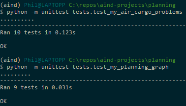

Artificial Intelligence Nanodegree Projects
===========================================

# Udacity Staff Submissions

Air cargo transport code file submission: [`my_air_cargo_problems.py`](./my_air_cargo_problems.py)

Planning graph code file submission: [`my_planning_graph.py`](./my_planning_graph.py)

Heuristic analysis submission: [`heuristic_analysis.pdf`](./heuristic_analysis.pdf)

Research review submission: [`research_review.pdf`](./research_review.pdf)

# Implementing a Planning Search

For this project, we implement a planning search agent to solve deterministic logistics planning problems for an Air Cargo transport system. We use a **planning graph** and **automatic domain-independent heuristics with A* search** and compare their results/performance against several **uninformed non-heuristic search methods** (breadth-first, depth-first, etc.).

## Install

This project requires **Python 3**. We installed [Anaconda3 v4.3.7](https://www.continuum.io/downloads), a pre-packaged Python distribution that contains all of the necessary libraries and software for this project. We also used the saved environment provided in the Anaconda lesson of the Nanodegree.

## Code

* `my_air_cargo_problems.py` - Contains the code to solve deterministic logistics planning problems (see `AirCargoProblem` class).
* `my_planning_graph.py` - Contains our planning graph code (see `PlanningGraph` class).
* `tests/test_my_air_cargo_problems.py` and `tests/test_my_planning_graph.py`- Unmodified, as provided by the Udacity staff to unit test our implementation.
* `run_search.py` - Unmodified, as provided by the Udacity staff to evaluate the performance of our implementation.

Our implementation can be tested as follows:

```
$ source activate aind
(aind) $ cd ~
(aind) $ git clone https://github.com/philferriere/aind-projects.git
(aind) $ cd aind-projects/planning
(aind) $ python -m unittest tests.test_my_air_cargo_problems
(aind) $ python -m unittest tests.test_my_planning_graph
```



## Planning Problems

We were given three planning problems in the Air Cargo domain that use the same **action schema**:

```
Action(Load(c, p, a),
	PRECOND: At(c, a) ∧ At(p, a) ∧ Cargo(c) ∧ Plane(p) ∧ Airport(a)
	EFFECT: ¬ At(c, a) ∧ In(c, p))
Action(Unload(c, p, a),
	PRECOND: In(c, p) ∧ At(p, a) ∧ Cargo(c) ∧ Plane(p) ∧ Airport(a)
	EFFECT: At(c, a) ∧ ¬ In(c, p))
Action(Fly(p, from, to),
	PRECOND: At(p, from) ∧ Plane(p) ∧ Airport(from) ∧ Airport(to)
	EFFECT: ¬ At(p, from) ∧ At(p, to))
```
The three problems have different initial states, goals, and optimal solution length, as shown below:

- Problem 1 initial state and goal:
```
Init(At(C1, SFO) ∧ At(C2, JFK)
	∧ At(P1, SFO) ∧ At(P2, JFK)
	∧ Cargo(C1) ∧ Cargo(C2)
	∧ Plane(P1) ∧ Plane(P2)
	∧ Airport(JFK) ∧ Airport(SFO))
Goal(At(C1, JFK) ∧ At(C2, SFO))
```
The goal above can be reached using different plans, but the **optimal plan length is 6 actions**. Below is a sample plan with optimal length:
```
Load(C1, P1, SFO)
Load(C2, P2, JFK)
Fly(P1, SFO, JFK)
Fly(P2, JFK, SFO)
Unload(C1, P1, JFK)
Unload(C2, P2, SFO)
```
- Problem 2 initial state and goal:
```
Init(At(C1, SFO) ∧ At(C2, JFK) ∧ At(C3, ATL)
	∧ At(P1, SFO) ∧ At(P2, JFK) ∧ At(P3, ATL)
	∧ Cargo(C1) ∧ Cargo(C2) ∧ Cargo(C3)
	∧ Plane(P1) ∧ Plane(P2) ∧ Plane(P3)
	∧ Airport(JFK) ∧ Airport(SFO) ∧ Airport(ATL))
Goal(At(C1, JFK) ∧ At(C2, SFO) ∧ At(C3, SFO))
```
Here too, Problem 2's goal can be reached using different plans, but the **optimal plan length is 9 actions**, one of which is shown below:
```
Load(C1, P1, SFO)
Load(C2, P2, JFK)
Load(C3, P3, ATL)
Fly(P1, SFO, JFK)
Fly(P2, JFK, SFO)
Fly(P3, ATL, SFO)
Unload(C3, P3, SFO)
Unload(C2, P2, SFO)
Unload(C1, P1, JFK)
```

- Problem 3 initial state and goal:
```
Init(At(C1, SFO) ∧ At(C2, JFK) ∧ At(C3, ATL) ∧ At(C4, ORD)
	∧ At(P1, SFO) ∧ At(P2, JFK)
	∧ Cargo(C1) ∧ Cargo(C2) ∧ Cargo(C3) ∧ Cargo(C4)
	∧ Plane(P1) ∧ Plane(P2)
	∧ Airport(JFK) ∧ Airport(SFO) ∧ Airport(ATL) ∧ Airport(ORD))
Goal(At(C1, JFK) ∧ At(C3, JFK) ∧ At(C2, SFO) ∧ At(C4, SFO))
```
For Problem 3, the **optimal plan length is 12 actions**. Here's a sample plan that is optimal:
```
Load(C1, P1, SFO)
Load(C2, P2, JFK)
Fly(P1, SFO, ATL)
Load(C3, P1, ATL)
Fly(P2, JFK, ORD)
Load(C4, P2, ORD)
Fly(P1, ATL, JFK)
Fly(P2, ORD, SFO)
Unload(C4, P2, SFO)
Unload(C3, P1, JFK)
Unload(C2, P2, SFO)
Unload(C1, P1, JFK)
```

## Uninformed Search Strategies Analysis

Per [1] section 3.4, search strategies that come under the heading of uninformed search (a.k.a., blind search) have no additional information about states beyond that provided in the problem definition. All they can do is generate successors and distinguish a goal state from a non-goal state. In this section, we compare the performance of seven such strategies in terms of **speed** (execution time, measured in seconds), **memory usage** (measured in search node expansions) and **optimality** (Yes, if a solution of optimal length is found; No, otherwise). Note that the number of goal tests and number of new nodes are not reported in the tables below since they do not change the results of our analysis below.

Performance measures were collected using the following commands:
```
python run_search.py -p 1 -s 1 2 3 4 5 6 7 >> run_uninformed_search_results_p1.txt
python run_search.py -p 2 -s 1 3 5 7 >> run_uninformed_search_results_p2.txt
python run_search.py -p 3 -s 1 3 5 7 >> run_uninformed_search_results_p3.txt
```
Note that for Problem 2, because their execution time exceeded 10 minutes, we cancelled data collection for Breadth First Tree Search, Depth Limited Search, and Recursive Best First Search (per Udacity staff instruction). For the same reason, with Problem 3 we did not collect any data for Breadth First Tree Search, Depth Limited Search, Uniform Cost Search, and Recursive Best First Search.

### Results

- Problem 1

|Search Strategy|Optimal|Path Length|Execution Time (s)|Node Expansions|
|:-|:-:|:-:|:-:|:-:|
|Breadth First Search|**Yes**|**6**|0.05|43|
|Breadth First Tree Search|**Yes**|**6**|1.67|1458|
|Depth First Graph Search|No|12|**0.01**|12|
|Depth Limited Search|No|50|0.16|101|
|Uniform Cost Search|**Yes**|**6**|0.07|55|
|Recursive Best First Search|**Yes**|**6**|4.81|4229|
|Greedy Best First Graph Search|**Yes**|**6**|**0.01**|**7**|

> Note: Both for Execution Time and Node Expansions, smaller numbers are better. Best of each category are highlighted in bold.

- Problem 2

|Search Strategy|Optimal|Path Length|Execution Time (s)|Node Expansions|
|:-|:-:|:-:|:-:|:-:|
|Breadth First Search|**Yes**|**9**|21.92|3401|
|Breadth First Tree Search|--|--|--|--|
|Depth First Graph Search|No|346|**2.29**|**350**|
|Depth Limited Search|--|--|--|--|
|Uniform Cost Search|**Yes**|**9**|68.33|4761|
|Recursive Best First Search|--|--|--|--|
|Greedy Best First Graph Search|**Yes**|**9**|4.62|550|

- Problem 3

|Search Strategy|Optimal|Path Length|Execution Time (s)|Node Expansions|
|:-|:-:|:-:|:-:|:-:|
|Breadth First Search|**Yes**|**12**|154.4|14491|
|Breadth First Tree Search|--|--|--|--|
|Depth First Graph Search|No|1878|**29.84**|**1948**|
|Depth Limited Search|--|--|--|--|
|Uniform Cost Search|**Yes**|**12**|570.98|17783|
|Recursive Best First Search|--|--|--|--|
|Greedy Best First Graph Search|No|22|100.92|4031|

### Analysis

With this 3-problem set, **Breadth First Search** and **Uniform Cost Search** are the only two uninformed search strategies that **systematically yield an optimal action plan**. When it comes to execution speed and memory usage, **Depth First Graph Search** is the **fastest and uses the least memory**. However, it does not generate an optimal action plan (problem 1: plan length of 12 instead of 6, problem 2: plan length of 346 instead of 9, problem 3: plan length of 1878 instead of 12).

If *finding the optimal path length is critical*, what strategy should we use? Because it performs **faster and uses less memory** than Uniform Cost Search, **Breadth First Search** is the recommended search strategy. This isn't much of a surprise, as BFS is complete and optimal. Its only downside is memory usage, if the problem's branching factor is high, as shown in [1] section 3.4.7:


Which search strategy should we use, if *having an optimal path length is not the primary criteria*? For problems 2 and 3, the Depth First Graph Search plan lengths are so much longer than the optimal path length that it wouldn't make sense to use this search strategy. **Greedy Best First Graph Search is the best alternative**. In problems 1 and 2, it manages to find the optimal path. In problem 3, it does not find the optimal path but the path length it generates is 22 instead of 10, which is much better than Depth First Graph Search (1878 path length!). Moreover, it still provides execution time savings and uses less memory than the best search strategy for an optimal solution (Breadth First Search).

## Informed (Heuristic) Search Strategies Analysis

Per [1] section 3.5, informed search strategy — one that uses problem-specific knowledge beyond the definition of the problem itself — can find solutions more efficiently than can an uninformed strategy. In this section, we compare the performance of **A* Search using three different heuristics**. Here again, we evaluate these strategies in terms of **speed**, **memory usage** and **optimality**.

Performance measures were collected using the following commands:
```
python run_search.py -p 1 -s 8 9 10 >> run_informed_search_results_p1.txt
python run_search.py -p 2 -s 8 9 10 >> run_informed_search_results_p2.txt
python run_search.py -p 3 -s 8 9 >> run_informed_search_results_p3.txt
```
Note that for Problems 2 and 3, because its execution time exceeded 10 minutes, we did not collect data for A* Search with Level Sum heuristic (as suggested by the Udacity staff). For the same reason, with Problem 3 we did not collect any data for Breadth First Tree Search, Depth Limited Search, Uniform Cost Search, and Recursive Best First Search.

### Results

- Problem 1

|Search Strategy|Optimal|Path Length|Execution Time (s)|Node Expansions|
|:-|:-:|:-:|:-:|:-:|
|A* Search with h1 heuristic|**Yes**|**6**|**0.06**|55|
|A* Search with Ignore Preconditions heuristic|**Yes**|**6**|0.08|41|
|A* Search with Level Sum heuristic|**Yes**|**6**|5.10|**11**|

> Note: Both for Execution Time and Node Expansions, smaller numbers are better. Best of each category are highlighted in bold.

- Problem 2

|Search Strategy|Optimal|Path Length|Execution Time (s)|Node Expansions|
|:-|:-:|:-:|:-:|:-:|
|A* Search with h1 heuristic|**Yes**|**9**|61.62|4761|
|A* Search with Ignore Preconditions heuristic|**Yes**|**9**|**21.09**|1506|
|A* Search with Level Sum heuristic|**Yes**|**9**|1634.5|**86**|

- Problem 3

|Search Strategy|Optimal|Path Length|Execution Time (s)|Node Expansions|
|:-|:-:|:-:|:-:|:-:|
|A* Search with h1 heuristic|**Yes**|**12**|506.49|17783|
|A* Search with Ignore Preconditions heuristic|**Yes**|**12**|**119.96**|**5081**|
|A* Search with Level Sum heuristic|--|--|--|--|

### Analysis

While all heuristics yield an optimal action plan, only the h1 and Ignore Preconditions heuristics return results within the 10mn max execution time recommended by the Udacity staff.

Which heuristic should we use? Of the two strategies mentioned above, **A* Search with Ignore Preconditions heuristic is the fastest**. If we let search run to completion on our machine, **A* Search with Level Sum heuristic uses the least memory**, but its execution time is much slower (26 mn for problem 2!).

## Informed vs Uninformed Search Strategies

The search strategies that generate optimal plans are:
- Breadth First Search and Uniform Cost Search.
- A* Search with all three heuristics.

As we saw earlier, when it comes to execution speed and memory usage of uninformed search strategies, **Depth First Graph Search** is faster and uses less memory than Uniform Cost Search. As for informed search strategies, **A* Search with Ignore Preconditions heuristic** is the fastest and uses the least memory.

So, really, the choice is between Depth First Graph Search and A* Search with Ignore Preconditions heuristic. Here we compare their results against our 3-problem set.

- Problem 1

|Search Strategy|Optimal|Path Length|Execution Time (s)|Node Expansions|
|:-|:-:|:-:|:-:|:-:|
|Breadth First Search|**Yes**|**6**|**0.05**|43|
|A* Search with Ignore Preconditions heuristic|**Yes**|**6**|0.08|**41**|

> Note: Both for Execution Time and Node Expansions, smaller numbers are better. Best of each category are highlighted in bold.

- Problem 2

|Search Strategy|Optimal|Path Length|Execution Time (s)|Node Expansions|
|:-|:-:|:-:|:-:|:-:|
|Breadth First Search|**Yes**|**9**|21.92|3401|
|A* Search with Ignore Preconditions heuristic|**Yes**|**9**|**21.09**|**1506**|

- Problem 3

|Search Strategy|Optimal|Path Length|Execution Time (s)|Node Expansions|
|:-|:-:|:-:|:-:|:-:|
|Breadth First Search|**Yes**|**12**|154.4|14491|
|A* Search with Ignore Preconditions heuristic|**Yes**|**12**|**119.96**|**5081**|

From the results above, because it is faster and uses less memory, **A* Search with Ignore Preconditions heuristic** would be the best choice overall for our Air Cargo problem.

### Conclusion

The results above clearly illustrate the benefits of using informed search strategies with custom heuristics over uninformed search techniques when searching for an optimal plan. The benefits are significant both in terms of speed and memory usage. Another, more subtle, benefit is that one can customize the trade-off between speed and memory usage by using different heuristics, which is simply not possible with uninformed search strategies.

## Research Review

Having greatly enjoyed working with distributed platforms (Spark, Hadoop, etc.) in the past, for this research review, we chose to focus on the challenges of **distributed multi-agent planning (DMAP)** techniques. To guide us through this quick exploration, we relied in large parts on the work of B.K. Durkota as presented in [2].

### DMAP Challenges

The challenges of DMAP are many. If a particular agent is unable to solve a problem on its own and has its own actions, **how should its actions and the actions of the other agents be interleaved**? Coordination implies communication. In order not to incur a huge network overhead and slowing down the agents too much, **what is the best paradigm to use for coordination**?

### DMAP Approaches

As listed in [2], three recent approaches include:
- Distributed Constraint Satisfaction Problem solving for coordination of the agents and individual planning using local search [4],
- Multi-agent adaptation of A* with local heuristics [5],
- Distribution of the GraphPlan approach based on merging of planning graphs [6].

In [3], Nissim et al use the **DisCSP+Planning** algorithm to solve the multi-agent planning problem by separating the **public** and **private** aspects of the problems. In this paradigm, the public aspects (coordination between agents) is dealt with by the **coordination component** using a CSP searching for a sequence of **interaction points** between the agents and enforcing consistency requirements between actions. The local, internal aspect is dealt with by the **individual planning component** using a planner that handles the other types of constraints and encodes the local parts of the plan.

In [4], the authors based their work on the A* algorithm described in class. Similarly to regular A*, the **Multiagent Distributed A* (MA-A*)** algorithm maintains open lists of unvisited stateas and closed lists of already visited states for all agentss. Individual agents use local, potentially different, heuristics to decide which unvisited state should expand next. As in [4], actions must first be separated into public and individual actions. Agents send messages to each other to distribute the search at interaction points where the other agents can follow.

In [5], the authors use a distributed version of the planning graph data structure. They use the **Distributed Planning through Graph Merging (DPGM)** algorithm which first performs **global goal decomposition** (where each agent creates an individual goal). Then, it alternates **expansion** (where each agent builds new layers in their planning graphs) and **planning graph merging** (where agents share their actions until each of them reachs their individual goals). In the **individual plan extraction** phase, each agent extracts plans from its planning graph. The process ends with a **coordination** phase that yields a coordinated individual solution plan.

## Results

In [2], experimental results show DPGM to be efficient in domains which are not tightly coupled ("combinatorially easy"). The DisCSP+Planning is shown to be efficient in problems which are combinatorially hard from the perspective of individual planning. Finally, the implementation of MA-A* with set additive heuristics was shown to be most effective in highly coupled domains.

## References
[1] Artificial Intelligence: A Modern Approach (2010, 3rd Ed.), by S. Russell & P. Norvig

[2] Comparison of Deterministic Distributed and Multi-Agent Planning Techniques (2013), by B.K. Durkota @ https://cyber.felk.cvut.cz/theses/papers/343.pdf

[3] A general, fully distributed multi-agent planning algorithm (2010), by R. Nissim et al @ https://www.cs.bgu.ac.il/~raznis/AAMAS2010_0192_dd86c6585.pdf

[4] Multi-Agent A* for Parallel and Distributed Systems (2012), by R. Nissim et al @ https://www.cs.bgu.ac.il/~raznis/mafs.pdf

[5] Distributed planning through graph merging (2010), by D. Pellier @ https://hal.archives-ouvertes.fr/hal-00981656/document

