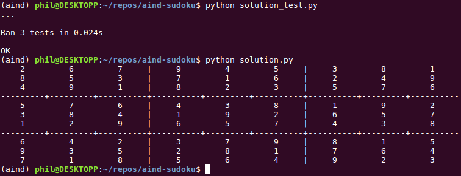

Artificial Intelligence Nanodegree Projects
===========================================

# Introductory Project: Diagonal Sudoku Solver

## Question 1 (Naked Twins)

Q: How do we use constraint propagation to solve the naked twins problem?  
A: As explained [in detail](#naked-twins-rule) below, we first find pairs of identical values within each unit. To do this, we first identify potential candidates (boxes with only two digits) and match them in pairs (using sorting and grouping by value). After this, we simply remove the digits of the naked-twin pair from the other boxes in the unit. By repeatedly applying this constraint (along with other ones) until the Sudoku puzzle stops changing, we effectively perform constraint propagation.

## Question 2 (Diagonal Sudoku)
Q: How do we use constraint propagation to solve the diagonal sudoku problem?  
A: As also explained [below](#adding-support-for-diagonal-sudoku), we perform constraint propagation by repeatedly enforcing the strategy rules, reducing the set of possible values toward a possible solution for the Sudoku. To solve the diagonal sudoku problem, we actually do not need to modify the constraint propagation code itself. The reason is simple: the constraint propagation code does not actually care *where* each unit is located in the puzzle. It only needs to know *which* units it needs to transform. To add support for the diagonal constraint, we only had to **create two additional units that represent the diagonals of the grid**, as shown at the end of the `Discussion` section of this document.

## Install

This project requires **Python 3**. We installed [Anaconda3 v4.3.7](https://www.continuum.io/downloads), a pre-packaged Python distribution that contains all of the necessary libraries and software for this project. We also used the saved environment provided in the Anaconda lesson of the Nanodegree. Finally, we installed [pygame](http://www.pygame.org/download.shtml) to visualize the Sudoku updates performed by our solver.

## Code

* `solutions.py` - Contains the code for our Sudoku solver (see `Sudoku` class).
* `solution_test.py` - Unmodified, as provided by the Udacity staff to test our solution (run `python solution_test.py`).
* `PySudoku.py` - Unmodified, as provided by the Udacity staff to visualize our solution.
* `visualize.py` - Unmodified, as provided by the Udacity staff to visualize our solution.

This code can be tested as follows:

```
$ source activate aind
(aind) $ cd ~
(aind) $ git clone https://github.com/philferriere/aind-projects.git
(aind) $ cd aind-projects/sudoku
(aind) $ python solution_test.py
(aind) $ python solution.py
```

## Results

Our solver passed the unit tests and generated the following results:



## Visualization

Here's a visualization of the Sudoku solver at work:


## Discussion

As explained in [1], the objective of Sudoku is to fill a 9×9 grid of **boxes** with digits (numbers 1 to 9) so that each **unit** (column of boxes, row of boxes, or nine 3×3 subgrids) contains all of the digits from 1 to 9. The puzzle setter provides a partially completed grid, which for a well-posed puzzle has a unique solution, as illustrated below:


Before discussing strategy, let's agree on a few naming and labelling conventions:

rows : Rows are labelled by the letters A, B, C, D, E, F, G, H, I.
columns : Columns are labelled by the numbers 1, 2, 3, 4, 5, 6, 7, 8, 9.
box : Boxes are labelled 'A1', 'A2', ..., 'I9'. For any box, there are 20 peers.
unit : Each unit is a set of 9 boxes, and there are 27 units in total.
peer: For a particular box (such as 'A1'), its peers will be all other boxes that belong to the same unit (those boxes that belong to the same row, column, or 3x3 subgrid).

As shown in [2], there are many strategies players can use in order to solve Sudokus. Three very common ones are:

- *Elimination rule* - For each box with a single value, remove its value from the possible values of all of its peers.
- *Only-choice rule* - If a box in a unit would only allow for a specific digit, then that box must be assigned that digit.
- *Naked-twins rule* - Identify naked twins (two boxes in the same unit having the same two digits) and remove their individual digits from unit peers.

### Constraint Propagation

To enforce these rules, we use **constraint propagation**. As explained in [4], **constraint satisfaction** is the process of finding a solution to a set of constraints that impose conditions that variables must satisfy. A solution is therefore a set of values for the variables that satisfies all constraints. To converge toward that set of values, we repeatedly enforce the strategy rules, reducing the set of possible values toward a possible solution for the Sudoku. As explained in [5], this rule enforcement (a.k.a. transformation) is called **constraint propagation**.

From a coding perspective, this simply means that we loop through each transformation until the Sudoku grid stops changing, as shown below:
```python
    def reduce_puzzle(self, use_strategy1=True, use_strategy2=True, use_strategy3=True):
        '''
        Reduce Sudoku puzzle until the grid doesn't change using three strategies:
         1 - Iterate over all the boxes and for each box with a single value, remove its value from all its peers.
         2 - If there is only one box in a unit which would allow a certain digit, then that box must be assigned that digit.
         3 - Identify naked twins (two boxes in the same unit having the same two digits) and remove their individual digits from unit peers.

        Parameters
        ----------
        use_strategy1 : if True, apply eliminate()
        use_strategy2 : if True, apply only_choice()
        use_strategy3 : if True, apply naked_twins()

        Returns
        -------
        solved: bool, True if solved, False otherwise
        '''

        while True:
            old_grid = self.values.copy()

            if use_strategy1 is True:
                self.eliminate()

            if use_strategy2 is True:
                self.only_choice()

            if use_strategy3 is True:
                self.naked_twins()

            if old_grid == self.values:
                break

        return self.is_solved()
```

After this, if we haven't solved the puzzle, we switch to **search**, where we systematically try different values until we find a solution (see `Search` section).

#### Elimination and Only Choice Rules

The code used to enforce the first two rules is fairly straightforward, as shown below:

```python
    def eliminate(self):
        '''
        Iterate over all the boxes and for each box with a single value, remove its value from all its peers
        '''

        for box in self.boxes:
            if len(self.values[box]) == 1: # if self.values[box] in Sudoku.DIGITS:
                for peer in self.peers[box]:
                    if self.values[box] in self.values[peer] and len(self.values[peer]) > 1:
                        self.assign_value(peer,self.values[peer].replace(self.values[box], ''))

    def only_choice(self):
        '''
        If there is only one box in a unit which would allow a certain digit, then that box must be assigned that digit.
        '''

        for unit in self.all_units:
            for box_idx in range(len(unit)):
                if len(self.values[unit[box_idx]]) > 1:  # more than one digit possible at this loc
                    for digit in self.values[unit[box_idx]]:
                        isUniqueToThisBox = True
                        for other_box_idx in range(len(unit)):
                            if other_box_idx != box_idx and digit in self.values[unit[other_box_idx]]: # don't compare it to itself...
                                isUniqueToThisBox = False
                                break
                        if isUniqueToThisBox == True:
                            self.assign_value(unit[box_idx], digit)
```

#### Naked Twins Rule

The code for finding naked twins is a little bit more complicated as we must find pairs of identical values within each unit. In order to do so, we first identify potential candidates (boxes with only two digits) and match them in pairs (using sorting and grouping by value). After this, we simply remove the digits of the naked-twin pair from the other boxes in the unit:

```python
    def naked_twins(self):
        '''
        Identify naked twins and remove their individual digits from unit peers.
        '''

        for unit in self.all_units:
            candidates = [(box, self.values[box]) for box in unit if len(self.values[box]) == 2]
            if len(candidates) >= 2:
                sorted_candidates = sorted(candidates, key=itemgetter(1))
                paired_candidates = groupby(sorted_candidates, key=itemgetter(1))
                for digits, candidates in paired_candidates:
                    boxes = [candidate[0] for candidate in candidates]
                    if len(boxes) == 2:
                        for box in unit:
                            if box not in boxes:
                                for digit in digits:
                                    if digit in self.values[box] and len(self.values[box]) > 1:
                                        self.assign_value(box, self.values[box].replace(digit, ''))
``` 

### Search

If after constraint propagation we still haven't found a solution to the Sudoku puzzle, we simply switch to a *trial and error* approach. We look for boxes that have the smallest number of possible digits (two digits, then three, then four, etc.) and **pick one of the digits for that box**. Next, we apply constraint propagation on this tentative solution. If it results in a valid solution, then great, we're done. If after this, we've converged to a set of values where boxes can still take several values, we repeat this process, by looking again for a box with the smallest number of digits that we can test. One will immediately recognize this recursive process as a typical **depth-first search**. Here's our implementation:

```python
    def search(self):
        '''
        Search for a solution using depth-first search
        Search branches are built by splitting boxes with the smallest number of possible values

        Returns
        -------
        result: bool, set to False if a solution hasn't been found, True otherwise
        '''

        # First, apply elimination and check if we have a solution
        if self.reduce_puzzle() == True:
            # We can't branch down any further, but our solution may not be valid, so check!
            return self.is_valid()

        # We need to branch further down, but there's no point in doing so if we went down an invalid branch
        if self.is_valid() == False:
            return False

        # Build the list of boxes to split, ordered by increasing number of options
        splittable_boxes = {k:v for (k,v) in self.values.items() if len(v)>1}
        splittable_boxes = sorted(splittable_boxes, key=lambda box: len(splittable_boxes[box]))

        # There is absolutely NO REASONABLE EXPLANATION for the following hack to make a difference, but if you go
        # through the shortest boxes in LEXICAL ORDER, then this code solves the example provided much, much faster.
        # Could this just be an artifact of the way the puzzle itself was created?
        idx_start = idx_end = 0
        ordered_splittable_boxes = []
        while idx_end < len(splittable_boxes) - 1:
            while len(self.values[splittable_boxes[idx_start]]) == len(self.values[splittable_boxes[idx_end]]) and idx_end < len(splittable_boxes) - 1:
                idx_end += 1
            ordered_splittable_boxes.extend(sorted(splittable_boxes[idx_start:idx_end]))
            idx_start = idx_end

        # Perform the search
        for box in ordered_splittable_boxes:
            for digit in self.values[box]:
                new_grid = self.values.copy()
                new_grid[box] = digit
                new_sudoku = Sudoku(from_dict=new_grid)
                if new_sudoku.search() == True:
                    self.values = new_sudoku.values
                    return True

        # This sudoku has no solution
        return False
```

### Adding Support for Diagonal Sudoku

A diagonal Sudoku has the additional constraint that the two diagonals of the puzzle must also contain all of the digits from 1 to 9. How much code did we have to change to add this constraint? Very little. None of the constraint propagation code as it turns out. The reason is simple: the constraint propagation code does not actually care *where* each unit is located in the puzzle. It only needs to know *which* units it needs to transform. To add support for the diagonal constraint, we only had to **create two additional units that represent the diagonals of the grid**, as shown below:

```python
   # Constructor
    def __init__(self, is_diag_sudoku=False, from_string=None, from_dict=None):
        '''
        Build and init the board using either a string or a dict

        Parameters
        ----------
        is_diag_sudoku : bool, set to True for Diagonal Sudoku, set to False for regular Sudoku
        from_string : str[81], string with initial values from top left corner to bottom right corner.
            e.g., '..3.2.6..9..3.5..1..18.64....81.29..7.......8..67.82....26.95..8..2.3..9..5.1.3..'
        from_dict : dict, dictionary with box coordinate as key (e.g. 'A1') and a digit or '.' as value.
        '''

        self.boxes = self.cross(Sudoku.ROWS, Sudoku.COLS)

        self.values = self.grid_values(from_string, from_dict)

        self.row_units = [self.cross(row, Sudoku.COLS) for row in Sudoku.ROWS]

        self.col_units = [self.cross(Sudoku.ROWS, col) for col in Sudoku.COLS]

        self.square_units = [self.cross(square_row, square_col) for square_row in Sudoku. SQUARE_ROWS for square_col in Sudoku. SQUARE_COLS]

        self.all_units = self.row_units + self.col_units + self.square_units

        if is_diag_sudoku==True:
            self.diag_units = [[y+x for y,x in zip(Sudoku.ROWS, Sudoku.COLS)], [y+x for y,x in zip(Sudoku.ROWS, Sudoku.COLS[::-1])]]
            self.all_units += self.diag_units

        self.units = dict((box, [unit for unit in self.all_units if box in unit]) for box in self.boxes)

        self.peers = dict((box, set(sum(self.units[box], [])) - set([box])) for box in self.boxes)
```

### References

[1] Sudoku @ https://en.wikipedia.org/wiki/Sudoku

[2] Sudoku strategy @ http://www.sudokudragon.com/sudokustrategy.htm

[3] Peter Norvig's Solving Every Sudoku Puzzle @ http://norvig.com/sudoku.html

[4] Constraint satisfaction @ https://en.wikipedia.org/wiki/Constraint_satisfaction

[5] Constraint propagation @ https://en.wikipedia.org/wiki/Local_consistency
